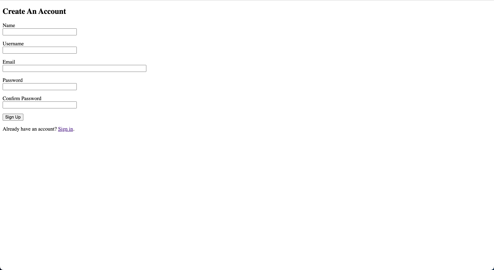
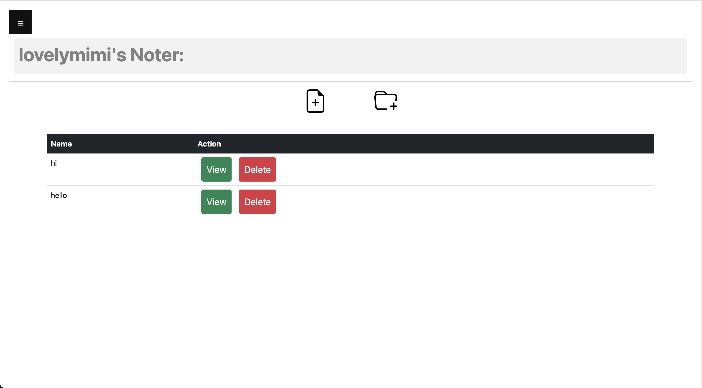
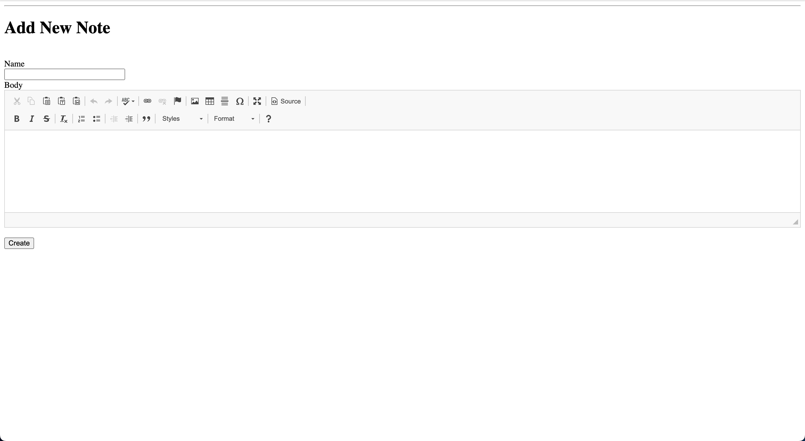
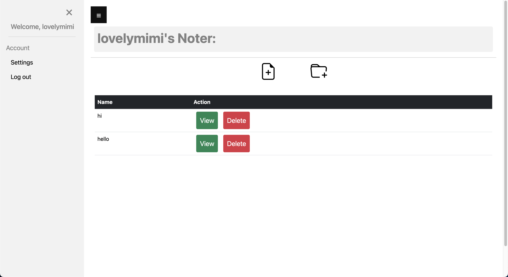

<h1 align="center"> Noter</h1>

# Project Members
- Martin Tran (@martintranthecoder) - Team Lead
- Hannah Ta (@hannahta420)
- Khai Truong (@tqkhai260595)

# Project Description:
Noter is a simple web-based note taking app for users. We uses Flask with Flask extensions such as Flask-Login, FLask-SQLAlchemy, etc. to wrtite this app. Noter provide the users with the solution to taking the note in their daily activities, classes, or works. In this app, you will be able to create notes, delete the notes and viewing the notes with rich text editor.

# Functional Requirements: 
(please check out our file named "[requirements.md](https://github.com/martintranthecoder/Noter/blob/main/requirements.md)")

# Packages:
 | Package Name           | Version      | 
  | ----------------------| -------------| 
  | Flask                 | 3.0.0       | 
  | Flask-Login           | 0.6.3       | 
  | Flask-SQLAlchemy      | 2.0.23      | 
  | Flask-WTF             | 1.2.1       | 
  | Flask-CKEditor        | 0.5.1       | 
  | email-validator       | 2.1.0.post1 | 
 
# Run Locally
(Before using our project app, please make sure you downloaded the recent versions of Python)

1. Clone our GitHub repository 
~~~bash
git clone https://github.com/martintranthecoder/Noter.git
~~~

2. Navigate to the Project Directory through terminal
~~~bash
cd Noter
~~~

3. Create a Virtual Environement 
~~~bash
python3 -m venv venv
~~~

4. Activate the `venv`
~~~bash
source venv/bin/activate
~~~

5. Install Packages
~~~bash
pip install flask flask-login flask-sqlalchemy flask-wtf flask-ckeditor email-validator
~~~

6. Start the server
~~~bash
flask run
~~~

# Recent Implementation
1. A simple user Sign Up page for user to create an account with our project to ensure the security of your notes. (**Martin Tran**)  

2. A simple Log In page after you registered an Account with us. (**Martin Tran**) 

3. Create/Delete Notes (**Hannah Ta & Martin Tran**)  

4. Storing Notes in the Database, so users can retrieve the notes they created whenever they want (**Hannah Ta & Khai Truong**) 

5. Rich Text Editor when users create new note (**Khai Truong & Martin Tran**)  

6. A Log Out Function for you to log out of your note page (**Martin Tran**)  

