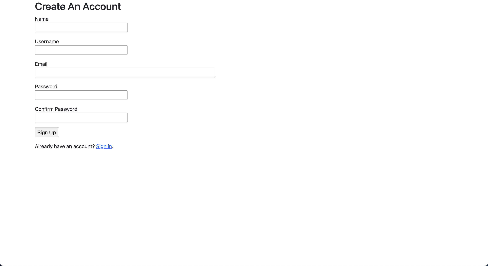
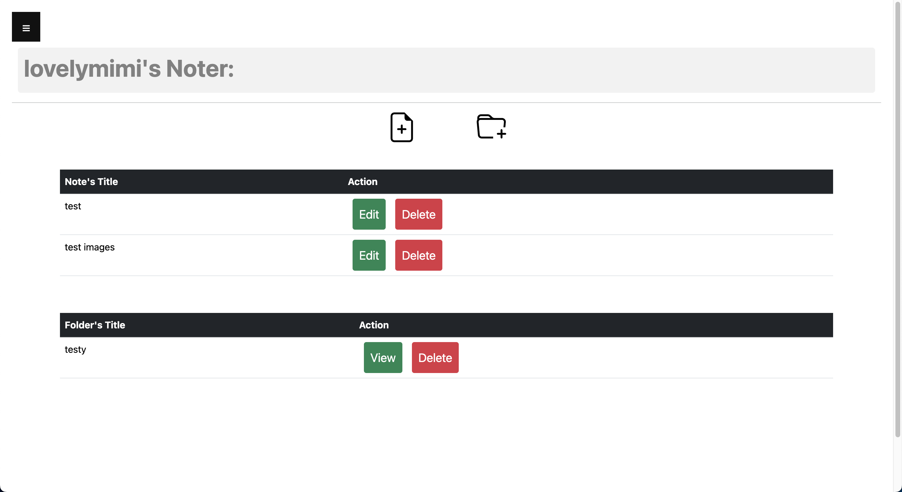

<p align="center">

</p>

<h1 align="center"> Noter</h1>

# Project Members
- Martin Tran (@martintranthecoder) - Team Lead
- Hannah Ta (@hannahta420)
- Khai Truong (@tqkhai260595)

# Project Description:
Noter is a simple web-based note-taking app for users. We use Flask with Flask extensions such as Flask-Login, FLask-SQLAlchemy, etc. to write this app. Noter provide the users with a solution to taking note in their daily activities, classes, or work. In this app, you will be able to create notes, delete notes, and view the notes with a rich text editor.

# Project Overview Video:
https://drive.google.com/drive/folders/16wQnlh2UQL3AYJ3SkEwrTICOlCvQPmaI

# Functional Requirements: 
(please check out our file named "[requirements.md](https://github.com/martintranthecoder/Noter/blob/main/requirements.md)")

# Packages:
 | Package Name           | Version      | 
  | ----------------------| -------------| 
  | Flask                 | 3.0.0       | 
  | Flask-Login           | 0.6.3       | 
  | Flask-SQLAlchemy      | 2.0.23      | 
  | Flask-WTF             | 1.2.1       | 
  | Flask-CKEditor        | 0.5.1       | 
  | email-validator       | 2.1.0.post1 | 
 
# Run Locally
(Before using our project app, please make sure you downloaded the recent versions of Python)

1. Clone our GitHub repository 
~~~bash
git clone https://github.com/martintranthecoder/Noter.git
~~~

2. Navigate to the Project Directory through the terminal
~~~bash
cd Noter
~~~

3. Create a Virtual Environment 
~~~bash
python3 -m venv venv
~~~

4. Activate the `venv`
~~~bash
source venv/bin/activate
~~~

5. Install Packages
~~~bash
pip install flask flask_sqlalchemy flask-ckeditor email-validator Werkzeug==3.0.1 Flask-Login==0.6.3 Flask-WTF==1.2.1
~~~

6. Start the server
~~~bash
flask run
~~~


⚠️ ATTENTION ⚠️
When first running the website, you may encounter this problem:

```
ImportError: cannot import name 'url_decode' from 'werkzeug.urls'
```
=> We recommend you should close the tab or terminal, then re-run the application later <br>
This is a little bug in the software and packages that we are using for the project. Thank you for understanding

# Recent Implementation
1. A simple user Sign-up page for users to create an account with our project to ensure the security of your notes. (**Martin Tran & Khai Truong**) <br>


2. A simple Login page after you register an Account with us. (**Martin Tran & Hannah Ta**)<br>


3. Create/Delete Notes (**Hannah Ta & Martin Tran**) <br>


4. Storing Notes in the Database, so users can retrieve the notes they created whenever they want (**Hannah Ta & Khai Truong**) 

5. Rich Text Editor when users create new notes (**Khai Truong & Martin Tran**) <br>


6. A Log Out Function for you to log out of your note page (**Martin Tran**) <br>


7. Ability to Create Folders (**Martin Tran**) <br>


8. Viewing Folders (**Martin Tran**) <br>


9. Attach Images inside notes via URLs (**Martin Tran & Khai Truong**) <br>


10. Editing Notes (**Hannah Ta**) <br>


11. Password Recovery (**Hannah Ta**) <br>


